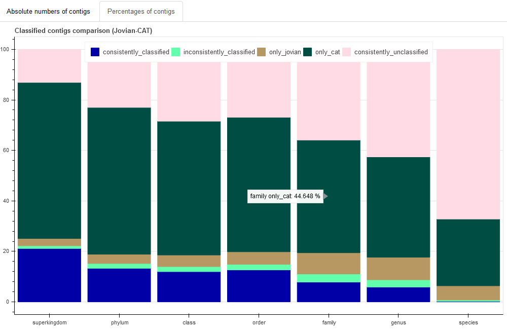

# Classification comparison

Compare taxonomic classifications of different tools in a 
metagenomics pipeline.  
Initial version: Compare [Contig Annotation Tool (CAT)](https://github.com/dutilh/CAT/)
to [Jovian](https://github.com/DennisSchmitz/Jovian). (_N.B. Jovian is in a private repository at the moment._)

-----

## Content
- [Requirements](#requirements)
- [User manual](#user-manual)
  - [Initial setup](#1-initial-setup)
  - [Set parameters](#2-set-the-parameters-to-match-your-setup)
  - [Run the pipeline](#3-run-cat-and-compare-the-results)
- [Pipeline description](#pipeline-description)
- [Pipeline output](#pipeline-output)
  - [Figures](#figures)
  - [Tables](#tables)
  - [Other files](#other-files)
- [Licence](#licence)

-----

## Requirements

This project depends on:
 - [Snakemake](https://snakemake.readthedocs.io/en/stable/)  (tested with versions 5.2.2 and 5.3.0)
 - [conda](https://conda.io/en/latest/) (tested with version 4.6.4)
 - (optional) [DRMAA](https://pypi.org/project/drmaa/) (for use on a high-performance computing (HPC) cluster or grid computer)

Please make sure you have both installed before trying to run this software. 
Other software dependencies are installed with conda 
(for details see YAML files in `envs/`).

The pipeline has only been tested on **GNU/Linux**, specifically 
_Red Hat Enterprise Linux Server release 7.6 (Maipo)_. 
It is likely to work just as well on any conda and Snakemake compatible system.

The current configuration is made for use on a HPC cluster using 
[LSF](https://www.ibm.com/us-en/marketplace/hpc-workload-management) as 
scheduler with (Python) [DRMAA](https://pypi.org/project/drmaa/) as interface. 
If necessary, the configuration files may be edited to work on a different 
system.

-----

## User manual

_N.B. The manual will use conda for installing software. Other options exist,_
_but have not been tested._  
_Also, this tool assumes you have already run the Jovian metagenomics pipeline_
_and have its results ready._

### 1. Initial setup

1. **Install conda**, following the instructions from 
https://conda.io/projects/conda/en/latest/user-guide/install/index.html#regular-installation

2. **Install Snakemake**, for instance using a conda environment:  
`conda create -n snakemake snakemake=5.3.0 -c bioconda -c conda-forge`  
(version number may be omitted to install the latest available version)

3. **Get the project code** from GitHub:  
`git clone [link to project]`

4. **Change directory** into the downloaded folder:  
`cd classification_comparison`

### 2. Set the parameters to match your setup

_Optional: if **not working on the same HPC** cluster:_  
 - Edit the lines starting with "drmaa" and "jobname" in `conf/config.yaml` using 
a text editor. (Adjust to your own system, or remove the lines.)  
Also, if you have more or fewer than 12 CPU cores on your machine, you can edit
the line "run_diamond_blastp: 12" under "threads:" accordingly.

_Optional: if you want to **experiment with Prodigal/Diamond parameters**:_
 - Edit the "Custom parameters" part (bottom) of `conf/parameters.yaml`.

1. **Edit** `conf/parameters.yaml` to point to the necessary files:
 - `source_dir` points to the Jovian folder
 - `work_dir` points to the folder where CAT's results and the comparison
 results will be stored 
 (for example: the folder where you downloaded this project)
 - `db_dir` points to the directory where the reference databases for CAT are
 stored 
 (for example: `/mnt/db/CAT`)
 - `samples` is a list of sample names (i.e. file prefixes) of the samples you
 want to analyse with CAT and compare to Jovian's Megablast (e.g. if you started
 with fastq files like `SRR7892426_R1.fastq` and `SRR7892426_R1.fastq`, then
 the sample name is "SRR7892426")

### 3. Run CAT and compare the results

1. (If using Snakemake from a **conda environment, activate it**.)  
`source activate snakemake`

2. Do a snakemake-**dry run** to test if the configuration files are correct:  
`snakemake --snakefile Compare_CAT.sm --profile conf -n`

3. **Run snakemake**:  
`snakemake --snakefile Compare_CAT.sm --profile conf`

4. **Wait** until the analysis is finished and then **browse the results** in 
the `results/` folder.  
Figures can be found in `results/figures/` and can be viewed
directly in a webbrowser. Tables in are in `results/tables/` and can for example
be used in small tests. E.g. the question "which virus species were identified
by both methods?" can be tested with 
`cut -f 1 results/tables/OVERALL.Jovian-CAT.comparison.species.tsv | grep "virus"`.
(Such questions can be taylored to specific samples by changing the 1
(for "classified by both") to 2 (for "clasified only by Jovian") or 3 (for
"classified only by CAT"), "OVERALL" into the sample name, 
taxonomic ranks by changing "species" to the desired rank,
and to taxonomic names by changing "virus" to the desired name. E.g.
`cut -f 3 results/tables/sample1.Jovian-CAT.comparison.*.tsv | grep "bacter"` finds
all contigs in "sample1" that were only classified by CAT and have "bacter" in
_any_ taxonomic rank (this should catch most bacteria and bacteriophages).)

-----

## Pipeline description

The current pipeline takes data from 
[Jovian](https://github.com/DennisSchmitz/Jovian).
It starts with the assembled contigs from 
[SPAdes](http://cab.spbu.ru/software/spades/), filtered with a minimum 
nucleotide length (default = 500). On them ORFs are predicted with 
[Prodigal](http://compbio.ornl.gov/prodigal/). These ORFs are then matched to 
the NCBI BLAST nr database with
[Diamond](http://ab.inf.uni-tuebingen.de/software/diamond/) blastp and 
classified using CAT, after which the whole contig is assigned a taxonomic name.

Simultaneously, Jovian classifications per contig, and annotations of unclassified
contigs are collected. These are merged with the classifications from CAT, and
finally these are compared and visualised in several different ways, per sample
and over all included samples (summed).

Below is a visualisation of the steps in the pipeline (a Snakemake rulegraph).

-----

## Pipeline output

The pipeline generates files in each step of the process. All output files are
described below. The following folders are created during the analysis:

| **Name**   | **Description** |
| ---------- | --------------- |
| `results/` | Holds directories `figures/`, `tables/` and `CAT/` and is where important results are stored |
| `log/`     | Holds directories `benchmark/` and `drmaa/` and contains information about running the commands (times, memory use, errors, etc.) |
| `tmp/`     | Stores temporary files and intermediates to the pipeline's output; may be interesting for debugging |

### Figures

The most important output of the pipeline are the figurs, which are generated
in the folder `results/figures/`. Currently, the following figures are made:

 - **Krona charts**  
  For each sample, CAT classifies the contigs. These classified contigs are
  visualised with [Krona](https://github.com/marbl/Krona/wiki) charts, in which
  the size of the taxa corresponds to the number of reads from the original
  read set that map to the classified contigs. These figures get the extension
  `Krona.html`.
  
 - **Concordant taxa histogram**  
  For each sample, as well as over all samples, we compare the classifications
  of each contig and see whether the two classification methods give identical
  classifications (taxa) or not, at 7 taxonomic ranks (X-axis). We count the 
  number of contigs (Y-axis) that have identical classifications ("consistently
  classified"), those that have different classifications ("inconsistently
  classified", e.g. one tool reports "Bacteria" and the other "Viruses" at
  the superkingdom level), those that only one of the two methods could
  classify ("only jovian" and "only cat"), and finally contigs that neither tool
  was able to classify ("consistently unclassified").  
  These figures can be recognised by the `concordant_taxa.html` extension,
  and are interactive: mouse-over to view exact contig numbers, and drag if
  anything disappears under the legend. There is also a tab that uses 
  percentages rather than absolute contig counts.  
  _This figure shows the fraction of overlap between the results of the two_
  _tools and also which tool could classify more contigs._

 
 - **Taxonomic profiles**  
  For all samples, stacked bar charts represent the taxonomic profile generated
  by each classification tool, summarising taxa on the superkingdom rank. 
  Again, classified contigs are quantified by the number of reads that map to
  them.  
  This figure has the extension `composition_graph.html` and is also an
  interactive figure that has mouse-over labels and can be dragged.  
  _This figure can be used to estimate taxonomic profiles from samples and_
  _compare profiles between the two methods. Also, it can be used to spot_
  _differences that are worth investigating further (e.g. one tools reports_
  _a high number of eukaryotes, while the other reports mostly bacteria:_
  _which tool is right?)_

 - **Overlapping classifications (taxa)**  
  Venn diagrams visualise the overlap between the reported taxa by each tool,
  at seven taxonomic ranks. At each rank, a deduplicated list of taxa is 
  collected for each tool and checked for overlap with the other tool. The taxa
  counted in the diagrams are stored separately (see [Tables](#tables) below).  
  These figures end on `venn.png`.  
  _The Venn diagrams also show the overlap in classifications, but now_
  _quantified by the taxa, not by reads. It can also be used to compare the_
  _output of the two tools. The taxa that appear in both lists are highly_
  _likely to be actually present in the original sample/patient._

### Tables

The tables are a different way of showing the same data visualised with the
figures. They may be viewed with spreadsheet programmes, or can be further
analysed with command-line tools. They are saved under `results/tables/`.

 - **List of classified taxa per tool**  
  These are tab-separated text files of the taxa behind the Venn diagrammes.
  They are generated per sample and as 'overall' lists and contain 3 columns:  
  1. 'Overlap': taxa that are reported by both methods
  2. 'Jovian': taxa reported only by Jovian
  3. 'CAT': taxa reported only by CAT  
  The tables' names end with `comparison.[rank].tsv` and can be used to answer
  questions such as: "which viral species were identified in sample X by both 
  methods?" usind the command: 
  `cut -f 1 X.Jovian-CAT.comparison.species.tsv | grep "vir"` or "how many genera
  with "bacter" in their name were only reported by CAT?" with:
  `cut -f 3 OVERALL.Jovian-CAT.comparison.genus.tsv | grep "bacter" | wc -l`.  
  Change these variables to match your research question:
  `cut -f [A] [B].Jovian-CAT.comparison.[C].tsv | grep [D] [E]`, where:  
  A = 1-3 (overlap (both), Jovian, CAT)  
  B = sample name, or "OVERLAP" for all samples  
  C = taxonomic rank (superkingdom, phylum, class, order, family, genus, 
  species, or "*" for all)  
  D = the string to search for (e.g. "virus" or "bacter")  
  E = optional, if you want counts rather than a list of names, add `| wc -l`
  to your command to count the lines of output
  
  This table looks something like this and is _alphabetically sorted_:
  
| **Overlap**     | **Jovian**         | **CAT**        |
| --------------- | ------------------ | -------------- |
| Anelloviridae   | Campylobacteraceae | Chlamydiaceae  |
| Bacillaceae     | Cyprinidae         | Cytophagaceae  |
| Enterococcaceae | Fabaceae           | Eubacteriaceae |
| Microviridae    | Formicidae         | Muribaculoceae |
| Siphoviridae    | Muridae            |                |
|                 | Staphylococcaceae  |                |

_(For examples, see [data/example](data/example).)_

 - **Table of concordant number of taxa**  
  The numbers behind the "concordant taxa histogram" are also saved as 
  tab-separated text files: both the absolute numbers and the percentages.
  They are called `concordant_taxa.tsv` and `concordant_taxa-percentages.tsv`,
  respectively.

### Other files

 - **Log files**  
  Each step or subprocess in the pipeline generates a log file. These store
  the Terminal output of the commands (stderr and/or stdout) in the `log/` 
  folder.  
  Secondly, benchmark logs are kept under `log/benchmark/` that log the runtime
  and memory usage of the commands.  
  When using the BioGrid cluster, or other LSF/DRMAA-compatible machine, drmaa
  logs are kept under `log/drmaa/` - separating stderr in a separate file 
  (`.err`) and a complete LSF log with the snakemake rule, command, times and
  resources used in another (`.out`) file.
 
 - **CAT output files**  
  CAT generates a list of output files, from ORF LCAs (Lowest Common Ancestors
  per Open Reading Frame), to contig classifications, to official taxonomic
  names. These are stored under `results/CAT/`.  
  CAT also creates its own log file, which can be found under `log/` as 
  `[sample].CAT.log`.

 - **Intermediary (temporary) files**  
  Some indermediate files are stored in the `tmp/` directory, including
  Diamond blastp output, Prodigal predicted ORFs and tables with information
  for Krona.
 
-----

## Licence

This project is licensed under the terms of the [GNU GPLv2 licence](LICENSE).
